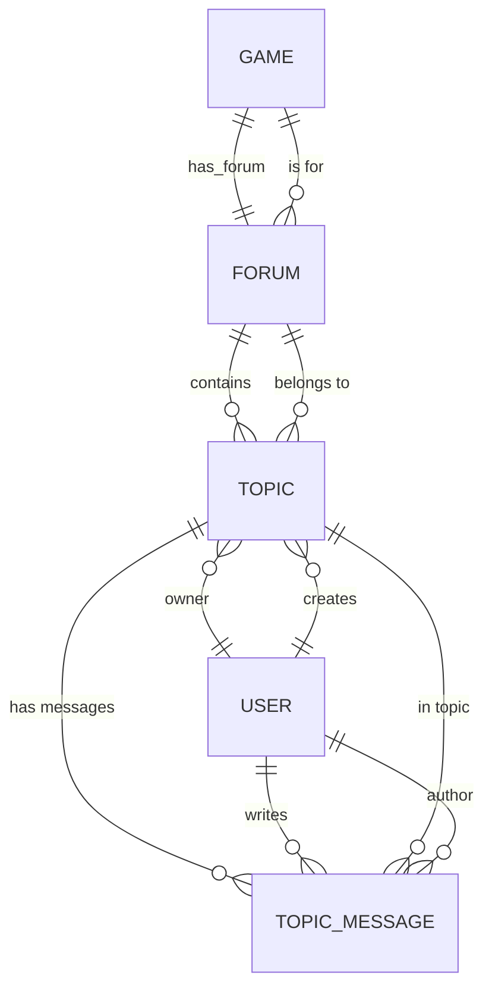

```mermaid
erDiagram
    GAME {}
    FORUM {}
    TOPIC {}
    TOPIC_MESSAGE {}
    USER {}

    GAME ||--|| FORUM           : has_forum
    FORUM }o--|| GAME           : "is for"
    FORUM ||--o{ TOPIC          : contains
    TOPIC }o--|| FORUM          : "belongs to"
    USER  ||--o{ TOPIC          : creates
    TOPIC }o--|| USER           : owner
    TOPIC ||--o{ TOPIC_MESSAGE  : "has messages"
    TOPIC_MESSAGE }o--|| TOPIC  : "in topic"
    USER  ||--o{ TOPIC_MESSAGE  : writes
    TOPIC_MESSAGE }o--|| USER   : author
```