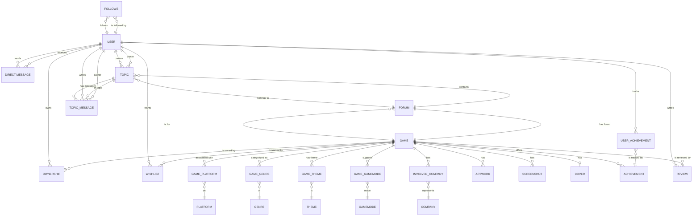

```mermaid
erDiagram
    USER {}
    OWNERSHIP {}
    WISHLIST {}
    GAME {}
    GAME_GENRE {}
    GENRE {}
    GAME_THEME {}
    THEME {}
    GAME_GAMEMODE {}
    GAMEMODE {}
    GAME_PLATFORM {}
    PLATFORM {}
    INVOLVED_COMPANY {}
    COMPANY {}
    ARTWORK {}
    SCREENSHOT {}
    COVER {}
    ACHIEVEMENT {}
    USER_ACHIEVEMENT {}
    FOLLOWS {}
    "DIRECT MESSAGE" {}
    REVIEW {}
    FORUM {}
    TOPIC {}
    TOPIC_MESSAGE {}

    USER          ||--o{ OWNERSHIP        : owns
    GAME          ||--o{ OWNERSHIP        : "is owned by"
    USER          ||--o{ WISHLIST         : wants
    GAME          ||--o{ WISHLIST         : "is wanted by"
    USER          ||--o{ REVIEW           : writes
    GAME          ||--o{ REVIEW           : "is reviewed by"
    GAME          ||--o{ GAME_PLATFORM    : "associated with"
    GAME_PLATFORM }o--|| PLATFORM        : on
    GAME          ||--o{ GAME_GENRE       : "categorized as"
    GAME_GENRE    }o--|| GENRE           : of
    GAME          ||--o{ GAME_THEME       : "has theme"
    GAME_THEME    }o--|| THEME           : is
    GAME          ||--o{ GAME_GAMEMODE    : supports
    GAME_GAMEMODE }o--|| GAMEMODE        : mode
    GAME          ||--o{ INVOLVED_COMPANY : has
    INVOLVED_COMPANY }o--|| COMPANY       : represents
    GAME          ||--o{ ARTWORK          : has
    GAME          ||--o{ SCREENSHOT       : has
    GAME          ||--o| COVER             : has
    GAME          ||--o{ ACHIEVEMENT      : offers
    USER          ||--o{ USER_ACHIEVEMENT : tracks
    USER_ACHIEVEMENT }o--|| ACHIEVEMENT  : "is tracked by"
    FOLLOWS       }o--|| USER            : follows
    FOLLOWS       }o--|| USER            : "is followed by"
    USER          ||--o{ "DIRECT MESSAGE" : sends
    USER          ||--o{ "DIRECT MESSAGE" : receives
    GAME          ||--|| FORUM           : "has forum"
    FORUM         }o--|| GAME            : "is for"
    FORUM         ||--o{ TOPIC           : contains
    TOPIC         }o--|| FORUM           : "belongs to"
    USER          ||--o{ TOPIC           : creates
    TOPIC         }o--|| USER            : owner
    TOPIC         ||--o{ TOPIC_MESSAGE   : "has messages"
    TOPIC_MESSAGE }o--|| TOPIC           : "in topic"
    USER          ||--o{ TOPIC_MESSAGE   : writes
    TOPIC_MESSAGE }o--|| USER            : author
```