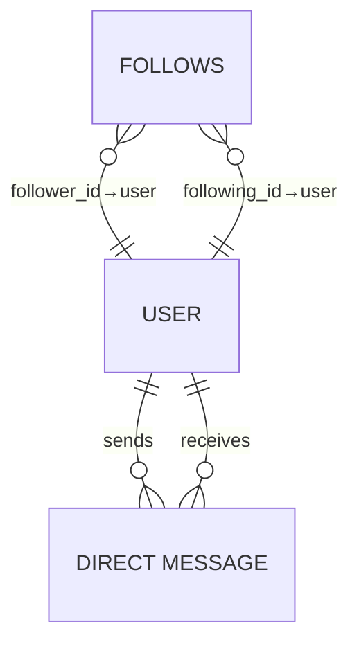

```mermaid
erDiagram
    USER {}
    FOLLOWS {}
    "DIRECT MESSAGE" {}

    FOLLOWS }o--|| USER : "follower_id→user"
    FOLLOWS }o--|| USER : "following_id→user"
    USER   ||--o{ "DIRECT MESSAGE" : sends
    USER   ||--o{ "DIRECT MESSAGE" : receives
```