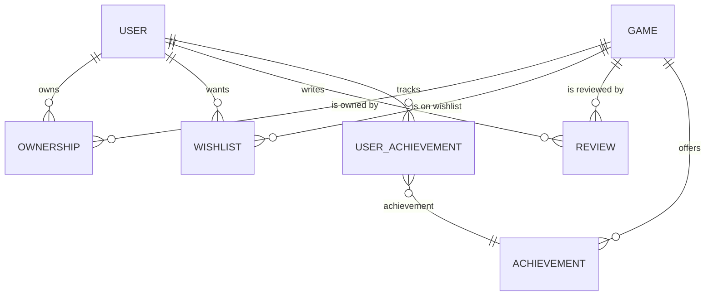

```mermaid
erDiagram
    USER {}
    GAME {}
    OWNERSHIP {}
    WISHLIST {}
    REVIEW {}
    ACHIEVEMENT {}
    USER_ACHIEVEMENT {}

    USER ||--o{ OWNERSHIP        : owns
    GAME ||--o{ OWNERSHIP        : "is owned by"
    USER ||--o{ WISHLIST         : wants
    GAME ||--o{ WISHLIST         : "is on wishlist"
    USER ||--o{ REVIEW           : writes
    GAME ||--o{ REVIEW           : "is reviewed by"
    GAME ||--o{ ACHIEVEMENT      : offers
    USER ||--o{ USER_ACHIEVEMENT : tracks
    USER_ACHIEVEMENT }o--|| ACHIEVEMENT : achievement
```