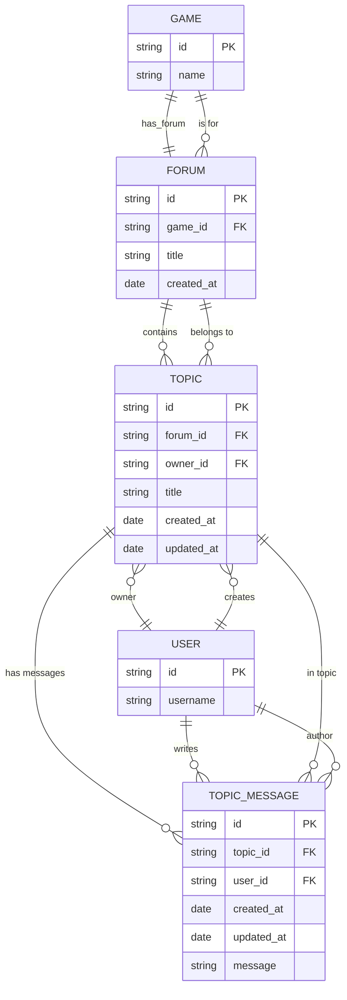

```mermaid
erDiagram
    GAME {
        string id   PK
        string name
    }
    FORUM {
        string id      PK
        string game_id FK
        string title
        date   created_at
    }
    TOPIC {
        string id         PK
        string forum_id   FK
        string owner_id   FK
        string title
        date   created_at
        date   updated_at
    }
    TOPIC_MESSAGE {
        string id       PK
        string topic_id FK
        string user_id  FK
        date   created_at
        date   updated_at
        string message
    }
    USER {
        string id       PK
        string username
    }

    %% forum linkage
    GAME ||--|| FORUM       : has_forum
    FORUM }o--|| GAME       : "is for"
    %% topics
    FORUM ||--o{ TOPIC      : contains
    TOPIC }o--|| FORUM      : "belongs to"
    USER  ||--o{ TOPIC      : creates
    TOPIC }o--|| USER       : owner
    %% messages
    TOPIC ||--o{ TOPIC_MESSAGE : "has messages"
    TOPIC_MESSAGE }o--|| TOPIC : "in topic"
    USER  ||--o{ TOPIC_MESSAGE : writes
    TOPIC_MESSAGE }o--|| USER  : author
```