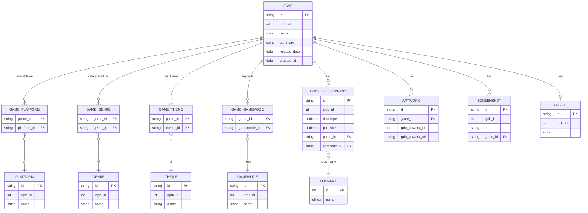

```mermaid
erDiagram
    GAME {
        string id           PK
        int    igdb_id
        string name
        string summary
        date   release_date
        date   created_at
    }
    PLATFORM {
        string id    PK
        int    igdb_id
        string name
    }
    GAME_PLATFORM {
        string game_id     FK
        string platform_id FK
    }
    GENRE {
        string id    PK
        int    igdb_id
        string name
    }
    GAME_GENRE {
        string game_id  FK
        string genre_id FK
    }
    THEME {
        string id    PK
        int    igdb_id
        string name
    }
    GAME_THEME {
        string game_id  FK
        string theme_id FK
    }
    GAMEMODE {
        string id    PK
        int    igdb_id
        string name
    }
    GAME_GAMEMODE {
        string game_id     FK
        string gamemode_id FK
    }
    COMPANY {
        int    id PK
        string name
    }
    INVOLVED_COMPANY {
        string id         PK
        int    igdb_id
        boolean developer
        boolean publisher
        string game_id    FK
        string company_id FK
    }
    ARTWORK {
        string id              PK
        string game_id         FK
        int    igdb_artwork_id
        string igdb_artwork_url
    }
    SCREENSHOT {
        string id      PK
        int    igdb_id
        string url
        string game_id FK
    }
    COVER {
        string id PK
        int igdb_id
        string url
    }

    %% platforms
    GAME ||--o{ GAME_PLATFORM    : "available on"
    GAME_PLATFORM }o--|| PLATFORM : on
    %% genres
    GAME ||--o{ GAME_GENRE       : categorized_as
    GAME_GENRE }o--|| GENRE     : of
    %% themes
    GAME ||--o{ GAME_THEME       : has_theme
    GAME_THEME }o--|| THEME     : of
    %% gamemodes
    GAME ||--o{ GAME_GAMEMODE    : supports
    GAME_GAMEMODE }o--|| GAMEMODE: mode
    %% companies
    GAME ||--o{ INVOLVED_COMPANY : has
    INVOLVED_COMPANY }o--|| COMPANY : "is company"
    %% media
    GAME ||--o{ ARTWORK          : has
    GAME ||--o{ SCREENSHOT       : has
    GAME ||--o| COVER            : has
```