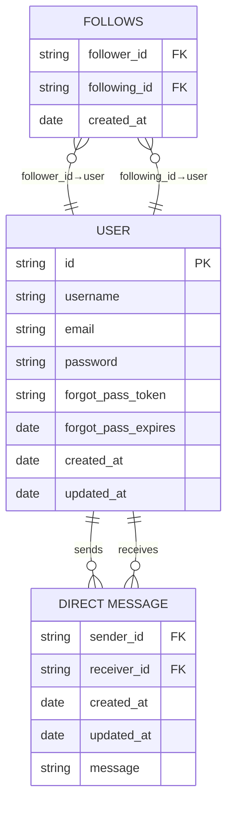

```mermaid
erDiagram
    USER {
        string id PK
        string username
        string email
        string password
        string forgot_pass_token
        date   forgot_pass_expires
        date   created_at
        date   updated_at
    }
    FOLLOWS {
        string follower_id  FK
        string following_id FK
        date   created_at
    }
    "DIRECT MESSAGE" {
        string sender_id   FK
        string receiver_id FK
        date   created_at
        date   updated_at
        string message
    }

    %% follower relationship
    FOLLOWS }o--|| USER : "follower_id→user"
    FOLLOWS }o--|| USER : "following_id→user"

    %% direct messages
    USER ||--o{ "DIRECT MESSAGE" : sends
    USER ||--o{ "DIRECT MESSAGE" : receives
```