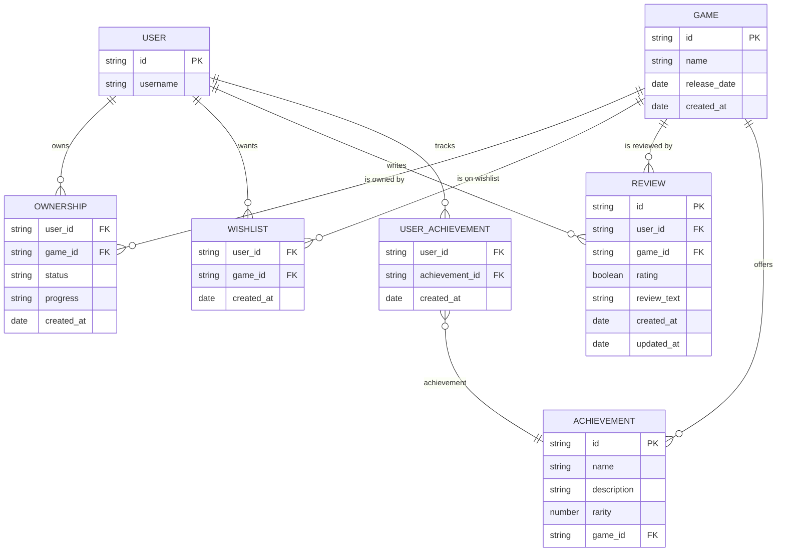

```mermaid
erDiagram
    USER {
        string id PK
        string username
    }
    GAME {
        string id PK
        string name
        date   release_date
        date   created_at
    }
    OWNERSHIP {
        string user_id  FK
        string game_id  FK
        string status
        string progress
        date   created_at
    }
    WISHLIST {
        string user_id FK
        string game_id FK
        date   created_at
    }
    REVIEW {
        string id      PK
        string user_id FK
        string game_id FK
        boolean rating
        string  review_text
        date    created_at
        date    updated_at
    }
    ACHIEVEMENT {
        string id          PK
        string name
        string description
        number rarity
        string game_id     FK
    }
    USER_ACHIEVEMENT {
        string user_id        FK
        string achievement_id FK
        date   created_at
    }

    %% ownership & wishlist
    USER ||--o{ OWNERSHIP       : owns
    GAME ||--o{ OWNERSHIP       : "is owned by"
    USER ||--o{ WISHLIST        : wants
    GAME ||--o{ WISHLIST        : "is on wishlist"
    %% reviews
    USER ||--o{ REVIEW          : writes
    GAME ||--o{ REVIEW          : "is reviewed by"
    %% achievements
    GAME ||--o{ ACHIEVEMENT     : offers
    USER ||--o{ USER_ACHIEVEMENT: tracks
    USER_ACHIEVEMENT }o--|| ACHIEVEMENT : achievement
```