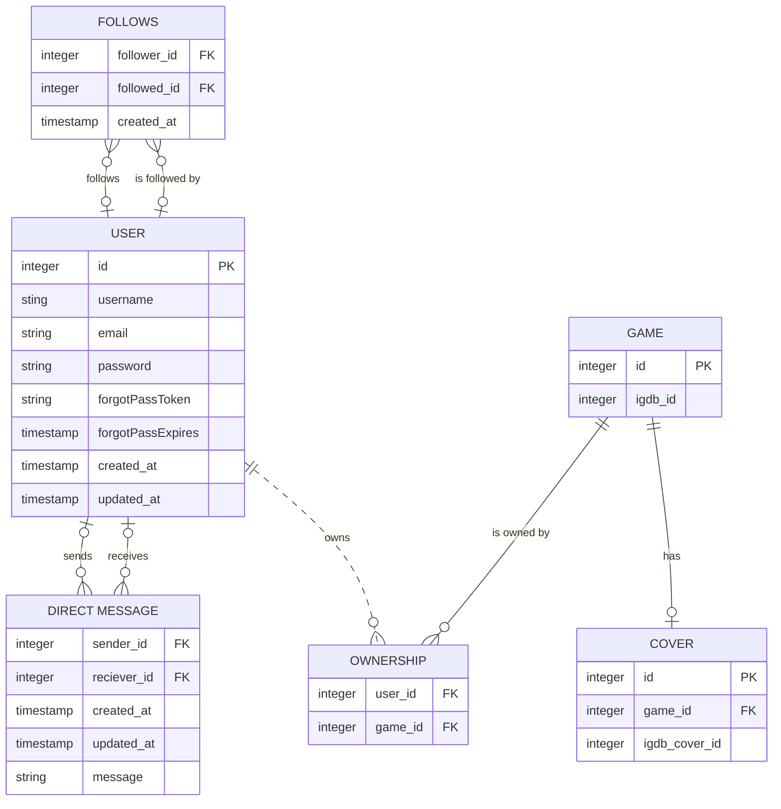

```mermaid
erDiagram
    USER {
        integer id PK
        sting username
        string email
        string password
        string forgotPassToken
        timestamp forgotPassExpires
        timestamp created_at
        timestamp updated_at
    }

    GAME {
        integer id PK
        integer igdb_id
    }

    COVER {
        integer id PK
        integer game_id FK
        integer igdb_cover_id
    }

    OWNERSHIP {
        integer user_id FK
        integer game_id FK
    }

    FOLLOWS{
        integer follower_id FK
        integer followed_id FK
        timestamp created_at
    }

    "DIRECT MESSAGE" {
        integer sender_id FK
        integer reciever_id FK
        timestamp created_at
        timestamp updated_at
        string message
    }

    USER ||..o{ OWNERSHIP : owns
    GAME ||--o{ OWNERSHIP : "is owned by"

    GAME ||--o| COVER : has

    FOLLOWS }o--o| USER : follows
    FOLLOWS }o--o| USER : "is followed by"

    USER |o--o{ "DIRECT MESSAGE" : sends
    USER |o--o{ "DIRECT MESSAGE" : receives
```
