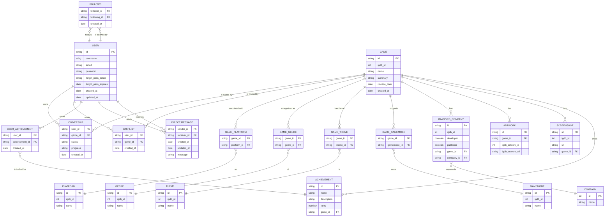

```mermaid
erDiagram
    %% User of SavePoint
    USER {
        string id PK
        sting username
        string email
        string password
        string forgot_pass_token
        date forgot_pass_expires
        date created_at
        date updated_at
    }

    %% User's game library
    OWNERSHIP {
        string user_id FK
        string game_id FK
        string status
        string progress
        date created_at
    }

    %% User's games wishlist
    WISHLIST {
        string user_id FK
        string game_id FK
        date created_at
    }

    %% Main game entry
    GAME {
        string id PK
        int igdb_id
        string name
        string summary
        date release_date
        date created_at
    }

    %% Game and Genre relationship
    GAME_GENRE {
        string game_id FK
        string genre_id FK
    }

    %% Genre classification
    GENRE {
        string id PK
        int igdb_id
        string name
    }

    %% Game and Theme relationship
    GAME_THEME {
        string game_id FK
        string theme_id FK
    }

    %% Themes, as in Horror, Sci-Fi etc.
    THEME {
        string id PK
        int igdb_id
        string name
    }

    %% Game and Game Mode relationship
    GAME_GAMEMODE {
        string game_id FK
        string gamemode_id FK
    }

    %% Game modes, including Single-player, Multiplayer etc.
    GAMEMODE {
        string id PK
        int igdb_id
        string name
    }

    %% Game and Platform relationship
    GAME_PLATFORM {
        string game_id FK
        string platform_id FK
    }

    %% Platform where games are available
    PLATFORM {
        string id PK
        int igdb_id
        string name
    }

    %% Links games with companies and their roles
    INVOLVED_COMPANY {
        string id PK
        int igdb_id
        boolean developer
        boolean publisher
        string game_id FK
        string company_id FK
    }

    %% Developers, publishers etc.
    COMPANY {
        int id PK
        string name
    }

    %% Artwork, including artworks, featured images etc.
    ARTWORK {
        string id PK
        string game_id FK
        int igdb_artwork_id
        string igdb_artwork_url
    }

    %% Screenshots from the game
    SCREENSHOT {
        string id PK
        int igdb_id
        string url
        string game_id FK
    }

    %% Achievements from the game
    ACHIEVEMENT {
        string id PK
        string name
        string description
        number rarity
        string game_id FK
    }

    %% User's game achievements
    USER_ACHIEVEMENT {
        string user_id FK
        string achievement_id FK
        date created_at
    }

    %% USER and USER relationship for follow system
    FOLLOWS {
        string follower_id FK
        string following_id FK
        date created_at
    }

    %% USER and USER relationship for direct messaging system
    "DIRECT MESSAGE" {
        string sender_id FK
        string receiver_id FK
        date created_at
        date updated_at
        string message
    }

    %% USER <-> GAME via OWNERSHIP
    USER ||--o{ OWNERSHIP : owns
    GAME ||--o{ OWNERSHIP : "is owned by"

    %% USER <-> GAME via WISHLIST
    USER ||--o{ WISHLIST : wants
    GAME ||--o{ WISHLIST : "is wanted by"

    %% GAME <-> PLATFORM via GAME_PLATFORM
    GAME ||--o{ GAME_PLATFORM : "associated with"
    GAME_PLATFORM }o--|| PLATFORM : on

    %% GAME <-> GENRE via GAME_GENRE
    GAME ||--o{ GAME_GENRE : "categorized as"
    GAME_GENRE }o--|| GENRE : of

    %% GAME <-> THEME via GAME_THEME
    GAME ||--o{ GAME_THEME : "has theme"
    GAME_THEME }o--|| THEME : is

    %% GAME <-> GAMEMODE via GAME_GAMEMODE
    GAME ||--o{ GAME_GAMEMODE : supports
    GAME_GAMEMODE }o--|| GAMEMODE : mode

    %% GAME <-> COMPANY via INVOLVED_COMPANY
    GAME ||--o{ INVOLVED_COMPANY : has
    INVOLVED_COMPANY }o--|| COMPANY : represents

    %% GAME <-> ARTWORK
    GAME ||--o{ ARTWORK : has

    %% GAME <-> SCREENSHOT
    GAME ||--o{ SCREENSHOT : has

    %% GAME <-> ACHIEVEMENT
    GAME ||--o{ ACHIEVEMENT : offers

    %% USER <-> ACHIEVEMENT via USER_ACHIEVEMENT
    USER ||--o{ USER_ACHIEVEMENT : tracks
    USER_ACHIEVEMENT }o--|| ACHIEVEMENT : "is tracked by"

    %% FOLLOWS/FOLLOWED from USER
    FOLLOWS }o--|| USER : follows
    FOLLOWS }o--|| USER : "is followed by"

    %% DIRECT MESSAGES from USER
    USER ||--o{ "DIRECT MESSAGE" : sends
    USER ||--o{ "DIRECT MESSAGE" : receives
```
